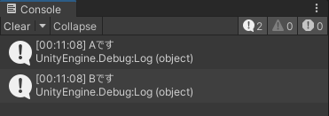

# オブジェクト指向言語とSOLID原則

クラスの設計をはじめる前に、設計の基礎となるオブジェクト指向とSOLID原則について触れておきます。知らなかったり分からないことがあっても軽くでよいので目を通してください。経験を積んでいるうちに気がつけば理解しています。

## オブジェクト指向

システムを構成する要素をオブジェクト（＝もの）に分解して、小さいオブジェクトを作ってそれらがお互いにメッセージを送り合うことで大きなシステムを構築しましょう、という考え方です。

オブジェクト指向でプログラミングをするための機能を持たせたコンピューター言語をオブジェクト指向言語と呼びます。Unityが採用しているC#もオブジェクト指向言語です。オブジェクト指向言語の特徴と言われることが多い3つの機能があります。

 1. カプセル化
 2. 継承
 3. ポリモーフィズム（多態性、多相性）

それぞれについて簡単に説明します。

### memo
オブジェクト指向は便利な解釈ができるため、長年に渡ってさまざまな解釈で利用されてきました。提唱されたときの原理主義から実用性に振り切った考え方まで幅広く、何かを言い切るとあちこちから弾が飛んできます。そのため表現をぼやかしています。歴史や経緯を調べると面白いです。

オブジェクト指向言語の基本原則は、**抽象化**を加えた4つとする説明もあります。MicrosoftのC#のドキュメント（ https://learn.microsoft.com/ja-jp/dotnet/csharp/fundamentals/tutorials/oop ）はこちらで説明されています。

### カプセル化

オブジェクトがもつデータや処理は、オブジェクト自身の機能を実現するためのものと、他のオブジェクトとやりとりをするためのものに分けることができます。前者を隠して後者のみを公開することでオブジェクトの間違った利用やバグの混入を防ぐことができます。不要なものを内側に隠すということでカプセル化です。

アクセス修飾子によって公開範囲を設定することが代表的なカプセル化の手法です。本プロジェクトでは次の3種類のアクセス修飾子を使っています。

* public
  * 外部に公開します。
* protected
  * 自クラスと派生クラスに公開します。
* private
  * 自クラスでのみ利用できます。

他にもアセンブリやファイルに限定するような修飾子があります。詳しくは[Microsoftのアクセス修飾子のドキュメント](https://learn.microsoft.com/ja-jp/dotnet/csharp/language-reference/keywords/access-modifiers)をご覧ください。

### 継承

指定したクラスの機能を引き継いだり拡張したりする機能です。継承により、同じ処理をコピペをせずに使い回すことができます。C#ではクラス定義の後ろに`:`を書いて派生元になるクラス名を続けます。

UnityでC# Scriptを作成するとMonoBehaviourを継承したクラスが作成されます。MonoBehaviourを継承することで、ゲームオブジェクトにアタッチしたり、UpdateなどのメソッドがUnityから自動的に呼ばれるようになります。Unityを使っていると知らないうちに継承を利用しているのです。

### ポリモーフィズム

ポリモーフィズムは2つのルールから成り立ちます。

1. 子クラスのインスタンスは親クラスに代入できる
2. インスタンスのメンバは、インスタンスを生成したクラスのものが呼び出される

if文などの分岐を使わずに処理を呼び分けることができる強力な機能です。この機能を正しく活用できていると初心者の域は脱したと感じます。言葉では説明しにくいのでコードと実行結果を示します。

```cs
// HelloCaller.cs
// ポリモーフィズムの例

using UnityEngine;

public class HelloA
{
    public virtual void Hello()
    {
        Debug.Log（"Aです"）;
    }
}

public class HelloB : HelloA
{
    public override void Hello()
    {
        Debug.Log（"Bです"）;
    }
}

public class HelloCaller : MonoBehaviour
{
    void Start()
    {
        HelloA[]hellos = { new HelloA（), new HelloB(） };

        foreach （var hello in hellos）
        {
            hello.Hello();
        }
    }
}

```

UnityでC# Scriptを作成してHelloCallerという名前にして適当なGameObjectにアタッチします。PlayするとConsoleに以下のような結果が出力されます。



HelloCaller.csの要点は次のとおりです。

* HelloBクラスはHelloAクラスを継承した子クラスです
* HelloCallerクラスで、HelloAクラス型の配列にHelloAクラスとHelloBクラスのインスタンスを代入しています
    * 子クラス（HelloB）のインスタンスを親クラス（HelloA）の型に代入できることがポリモーフィズムの1つ目のルールです
* HelloAクラスの配列に代入したインスタンスのHelloメソッドを呼び出しています
* HelloAクラスの配列ですが、HelloBクラスのHelloも呼ばれています
    * 代入されているインスタンスを生成したクラスの実装が呼ばれるのが、ポリモーフィズムの2つ目のルールです 

ポリモーフィズムは親クラスだけではなく、インターフェースでも機能します。

この性質を利用すると、データの種類をif文やswitch文で判定して機能を呼び分ける必要がなくなります。共通の親クラスかインターフェースを定義して、そこに利用したい派生クラスのインスタンスを代入しておけばメソッドを自動的に呼び分けてくれます。

条件分岐文をなくせることでプログラムが短くなることに加えて、条件分岐文を書き間違えるようなバグが起き得なくなります。構造的にバグが入る余地がなくなることはとても大きなメリットです。


## SOLID原則

SOLID原則は、オブジェクト指向言語の設計で役立つ5つの原則です。設計する際のよい指標になるので知っていると便利です。

### 単一責任の原則 Single-responsibility principle

> THERE SHOULD NEVER BE MORE THAN ONE REASON FOR A CLASS TO CHANGE.
> 
> http://www.objectmentor.com/resources/articles/srp.pdfより

「あるクラスを変更する理由が複数あってはならない。」という原則です。

たとえばプレイヤーキャラクターを制御するためのPlayerクラスがあるとします。プレイヤーと敵が接触したときの処理をこのクラスに実装することはあるでしょう。ただし、「敵のHPを減らして、ダメージがなくなったら敵を破壊する」というような敵のパラメーターに関わる処理までPlayerクラスに実装するのはよくありません。なぜなら敵のダメージの計算方法が変わった時に、敵の仕様変更なのにPlayerクラスの修正が必要になるからです。Playerクラスはプレイヤーキャラクターの仕様に対してだけ責任を持つべきです。

この場合なら敵や耐久度を管理するクラスにダメージを受け取るメソッドを用意して、プレイヤーからそのメソッドにダメージを渡します。これで単一責任の原則に合致します。

最初はプログラミングをするだけで精一杯で、どこにデータや処理を持たせればよいかまで考えが及ばないものです。その結果、あらゆるパラメーターを公開して、思いついたままあちこちに処理を実装する暴挙に出がちです。はじめはそのやり方でもとにかくプログラムを動かすことを優先させても構いません。考える余裕が出てきたら実装する前にその処理を実装すべき場所がどこかを考えてみてください。

### 開放閉鎖の原則 Open / closed principle

> SOFTWARE ENTITIES （CLASSES, MODULES, FUNCTIONS, ETC.） SHOULD BE OPEN FOR EXTENSION, BUT CLOSED FOR MODIFICATION.
> 
> https://Web.archive.org/Web/20150905081105/http://www.objectmentor.com/resources/articles/ocp.pdfより

「クラスやモジュール、関数などは、機能を拡張できる（オープン）ようにしつつ、既存のコードは修正できない（クローズド）ようにするべき」という原則です。

拡張する可能性がある機能をifなどの分岐文で呼び分ける作りにするとこの原則の違反になります。継承やポリモーフィズム、デリゲートの活用が鍵です。

### リスコフの置換原則 Liskov Substitution Principle

> FUNCTIONS THAT USE POINTERS OR REFERENCES TO BASE CLASSES MUST BE ABLE TO USE OBJECTS OF DERIVED CLASSES WITHOUT KNOWING IT.
> 
> http://www.objectmentor.com/resources/articles/lsp.pdfより

「関数ポインターや親クラスの型に、関数や子クラスを代入可能にします。代入されているものが何かを認識する必要はなく、呼び出せば代入したインスタンスに応じた処理が実行されます。」

ポリモーフィズムの振る舞いを説明した原則です。**「代入されているものが何かを認識する必要はなく」**という部分が大切です。クラスの実行前に、オブジェクトの型を判定する必要があるような実装をすると、この原則に違反します。


### インターフェース分離の原則 Interface segregation principle

> CLIENTS SHOULD NOT BE FORCED TO DEPEND UPON INTERFACES THAT THEY DO NOT USE.
> 
> http://www.objectmentor.com/resources/articles/isp.pdfより

たとえば、Playerクラスに、移動とダメージ処理を実装していたとします。移動処理では、入力に応じて、移動処理を呼び出します。この時、ダメージ処理は必要ありません。一方、敵の弾などは、接触時にプレイヤーのダメージ処理を呼び出します。この時、移動処理は必要ありません。

ここで、Playerクラスの移動処理とダメージ処理を、別のクラスに分割することになったとします。移動処理や敵の弾が、Playerクラスを指定してインスタンスを取得していた場合、分割したクラスに呼び変えるための修正が必要になります。インターフェース分離の原則を適用すると、このような修正を防ぐことができます。

例えば、移動用のメソッドをIMoveableインターフェースに定義して、ダメージを与えるメソッドをIDamageableインターフェースに定義します。そして、移動処理はIMoveableインターフェースのインスタンス、敵の弾はIDamageableインターフェースのインスタンスを取得して、メソッドを呼び出すように実装します。このようにしておけば、実装している場所がPlayerクラスから他のクラスに変わっても、インターフェースによって取得するインスタンスが自動的に変わるので、呼び出し元の移動や敵の弾の処理は、修正しなくて済みます。

クラスは、実装が複雑化すれば、後で分割する可能性があります。外部から利用する機能を、適切にインターフェースに定義しておくことで、クラスの修正に強い仕組みにできます。

### 依存関係逆転の原則 Dependency Inversion Principle

> A. HIGH LEVEL MODULES SHOULD NOT DEPEND UPON LOW LEVEL MODULES. BOTH SHOULD DEPEND UPON ABSTRACTIONS.
> 
> B. ABSTRACTIONS SHOULD NOT DEPEND UPON DETAILS. DETAILS SHOULD DEPEND UPON ABSTRACTIONS.
> 
> http://www.objectmentor.com/resources/articles/dip.pdfより


「通常の方向」が分からないと何が「逆転」なのか分かりません。ここでいう逆転とは、ハードウェア上で動くソフトウェアの階層のことです。Figのように表されます。

Fig. ソフトウェアの階層では最下層をハードウェアと位置づけます。その上にハードウェアを制御するソフトウェア、いわゆるデバイスドライバーが乗っかります。その上にデバイスドライバーとユーザーの操作を橋渡しするOS、さらにその上にアプリが乗っかります。

上から下が通常の方向です。よって、下から上に依存するべきというのがこの原則です。なぜ逆転させた方がよいかはFigのPCゲームの操作システム例を観察してみてください。

## オブジェクト指向とSOLID原則のまとめ

オブジェクト指向は、データや処理をオブジェクト（もの）にまとめてそれらを連携させてシステムを構築しましょう、という考え方です。

オブジェクト指向でプログラミングするための機能を持たせたコンピューター言語がオブジェクト指向言語です。カプセル化、継承、ポリモーフィズムという3つの機能が柱です。

オブジェクト指向言語の活かし方を教えてくれるのがSOLID原則です。単一責任の原則、開放閉鎖の原則、リスコフの置換原則、インターフェース分離の原則、依存関係逆転の原則の5つの原則から成り立ちます。適切に分割して、拡張や変更に強く、実装に柔軟性を持たせるための指針で、長期間メンテナンスや拡張をしながら利用するシステムの構築に役立ちます。

