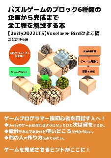

# Voxelorer Bird ひよこ編

Voxelorer Birdはボクセルの世界を冒険するトリのゲームです。
ひよこ編は、強風で家族の元から飛ばされたひよこのぴよが家に戻るお話です。
このプロジェクトをもとに、地下世界を探検する作品を企画中です。

本プロジェクトはひな形を公開して、試行錯誤している設計についてお披露目と
設計を学ぶ際の教材としてご利用いただくことを想定して公開しました。

教材といってもお手本としての利用は想定していません。設計について試行錯誤している
一例をご覧いただくことで、設計を理解する助けになるかも知れませんし、
悪例として挙げて改善するための土台として利用できるかも知れません。
良かれ悪しかれ利用方法はあるのではないかと考えています。

# 対応バージョン

- Unity6000.0.44f1
  - 書籍のUnity2022LTS向けは、[2022.3.10f1ブランチ](https://github.com/am1tanaka/VBirdHiyoko/tree/2022.3.10f1)を利用してください

# WebGL版

[WebGL版を遊ぶ](https://am1tanaka.github.io/VBirdHiyoko/Demo/)

## 遊び方

マウスで行きたい先や押したいブロックをクリックしてください。

右上の出口へたどり着けばクリアです。

# プロジェクトの開き方

Gitのコマンドツールが必要です。なければ https://git-scm.com/ などからインストールしてください。

1. 本リポジトリーをクローンかダウンロードする
1. 展開してUnity6.0以降で開く
   - 2022LTSで利用したい場合は、[2022.3.10f1ブランチ](https://github.com/am1tanaka/VBirdHiyoko/tree/2022.3.10f1)を利用してください
1. 最初に開いたときはTextMesh Proのアセットが必要なので、WindowメニューからTextMeshPro > Import TMP Essentialsを選んで、インポートする。インポートできたら、続けてImport TMP Examples & Extrasもインポートする
1. Projectウィンドウで、AM1 > VBirdHiyoko > Scenesの順にフォルダーを開いて、Systemシーンをダブルクリックして起動

以上でPlayできます。

## エラーが出たら

### Unityのバージョンをアップするとエラーが出る

古いUnityで開いたプロジェクトを、新しいUnityで開こうとすると、エラーが出る場合があります。Safe Modeでは開かず、Ignoreを選んで、普通にプロジェクトを開きます。プロジェクトが開いたら、WindowメニューのTextMesh Proから、Import TMP EssentialsとImport TMP Examples & Extrasを改めて読み込んでください。

# 解説本

本プロジェクトを題材にした技術書を出版しました。草ブロック、砂ブロック、氷ブロック、地面ブロック、岩ブロック、氷床ブロックの6種類のブロックを企画段階から実装するまで解説しています。初心者向けから一歩発展させて、企画を具体化させるときに実際に書いている資料を交えながら考え方を書きました。チュートリアルや手を動かすための内容ではなく、イメージトレーニングのための本という位置づけです。

[技術書典のサイト](https://techbookfest.org/product/nQdhDsspFhjK7zfWzmZMwK)で、電子書を販売しています。よろしければご購入のほど、よろしくお願いいたします！

<a href="https://techbookfest.org/product/nQdhDsspFhjK7zfWzmZMwK">
 
パズルゲームのブロック 6 種類の企画から完成まで全工程を解説する本～【Unity2022LTS】Voxelorer Bird ひよこ編～
</a>

## 解説本の補足資料

本プロジェクト関連の資料へのリンクです。

- [企画概要書](https://docs.google.com/document/d/1n1Oxek9KgKN5j5TC0U0y48OSzzlLONp_oDUDpGcu20s/edit?usp=sharing)
	- 企画概要書のGoogleドキュメントです
- [仕様書シート](https://docs.google.com/spreadsheets/d/1z6rZWF8qitYePpJ-e99rQprVXpgaBVB05CYN53RaDE0/edit?usp=sharing)
	- 仕様書のGoogleスプレッドシートです
- [オブジェクト指向とSOLID原則](./Docs/oop-solid/oop-solid.md)
	- 紙面の都合で掲載しきれなかった資料です
- [技術書執筆関連のメモ](./Docs/tech-book/tech-book.md)
	- 解説本を執筆するにあたっての参考資料やメモです

# ライセンス

本プロジェクトに含まれる素材やコードのライセンスは以下のとおりです。
著作者表示などの条件を守れば、組み込みや改変、再配布、販売ができます。
Unity以外の環境での利用も可能です。詳しくは各ライセンスをご確認ください。

- Assets/AM1以下
  - [MIT License Copyright (c) 2023 Yu Tanaka](./LICENSE)
- Assets/kenney_game_assets以下
  - Created/distributed by Kenney (www.kenney.nl)
  - License: (Creative Commons Zero, CC0)
- Assets/Mplus以下
  - M+ FONTS Copyright (C) 2002-2019 [M+ FONTS PROJECT](http://mplus-fonts.osdn.jp)
  - [SIL OPEN FONT LICENSE](https://scripts.sil.org/OFL_web)

# 参考URL
- [FRAME SYNTHESIS. Unity WebGLビルドメモ](https://tech.framesynthesis.co.jp/unity/webgl/)
	- WebGLに切り替えると表示されていた「Kernel 'MultiScaleVODownsample1' not found」などのエラーの直し方が掲載されていて助かりました。Post Processing VolumeのAmbient OcclusionのMode設定のMulti Scale Volumetric ObscuranceがWebGLに非対応なので変更が必要ということでした

